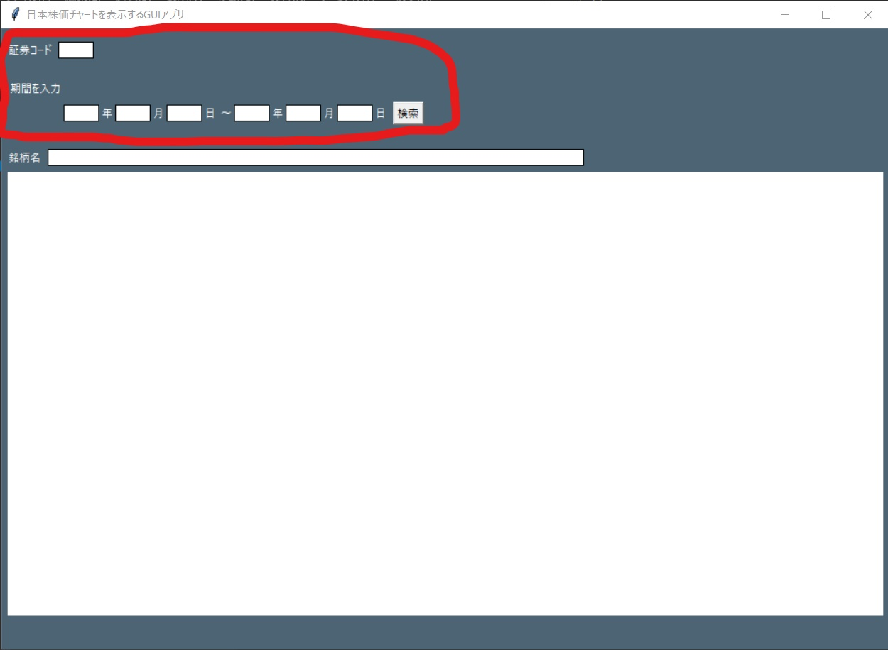

# StockChartGUI

# 概要
日本株価のチャートを取得できる、デスクトップアプリです。 
MAKUMAKU様で、公開されているソースコードを元に、レイアウトを変更しただけのアプリになります。 
下記の出典元に、リンクを載せております。

# 仕様
Pythonのtkinterで作成 
「Stooq」様から、日本株価のデータを取得 
「日本取引所グループ」様から、銘柄名を取得

# 使い方
空欄に、**半角数字**で入力する。 
**(※「銘柄名」の空欄は入力しない)** 
「検索」をクリックする。

例として、 
「証券コード」の欄に「2002」、 
「期間を入力」の欄に、「2000」年「1」月「1」日～「2022」年「1」月「1」日と入力する。 
**(※半角数字で入力する。)**

# 出典元
MAKUMAKU様 
(https://torimakujoukyou.com/python-tkinter-stockchartgui/) 
Stooq様 
(https://stooq.com/) 
日本取引所グループ様 
(https://www.jpx.co.jp/markets/statistics-equities/misc/)

